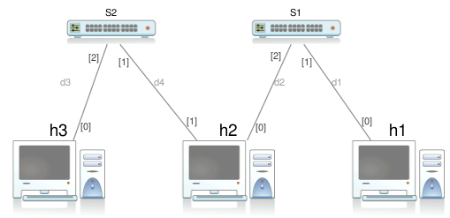
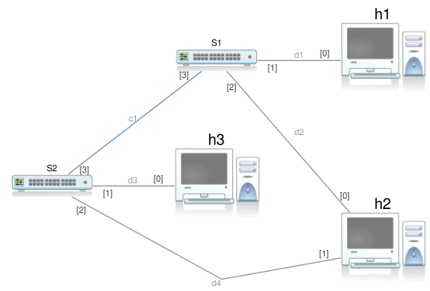
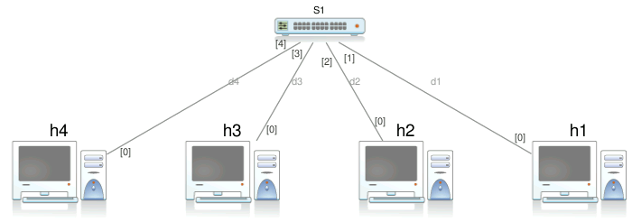

# Host to Network level

## Esercizio 1

Configurare una rete con topologia mostrata in figura e utilizzando gli indirizzi IP proposti in tabella. Utilizzare una configurazione permanente e alias degli host consistenti su ciascuna macchina. Il dispositivo S1 è uno SWITCH.

| Machine | IP address |
|---------|------------|
|@h1|192.168.1.1|
|@h2|192.168.1.2|
|@h3|192.168.1.3|

Testare la rete lanciando `arping` e `ping` da `@h1` verso `@h2` ed eseguendo `tcpdump` su `@h2` e su `@h3`.

Cosa si deduce osservando il traffico sui vari nodi? Si è ottenuto un risultato coerente con il funzionamento di uno switch?

> [Soluzione](./exercise-01.md)

## Esercizio 2

Configurare una rete con topologia mostrata in figura e utilizzando gli indirizzi IP proposti in tabella. Utilizzare una configurazione permanente e alias degli host consistenti su ciascuna macchina. Il dispositivo H1 è un HUB.

| Machine | IP address |
|---------|------------|
|@h1|192.168.1.1|
|@h2|192.168.1.2|
|@h3|192.168.1.3|

Testare la rete lanciando `arping` e `ping` da `@h1` verso `@h2` ed eseguendo `tcpdump` su `@h2` e su `@h3`.

Quali sono le differenze rispetto all'esercizio precedente?

> [Soluzione](./exercise-02.md)

## Exercise 3

Configurare una rete con topologia mostrata in figura e utilizzando gli indirizzi IP proposti in tabella. Impostare una configurazione automatica per le schede di rete e scegliere alias per gli host consistenti su ciascuna macchina.

| Machine | NIC | IP address |
|---------|-----|------------|
|@h1|eth0|192.168.1.10|
|@h2|eth0|192.168.1.20|
|@h2|eth1|192.168.1.21|
|@h3|eth0|192.168.1.30|

Eseguire il comando `arping` da ciascun nodo verso ciascuno degli altri nodi/interfaccie e verificare ciò che accade.

> [Soluzione](./exercise-03.md)

## Exercise 4

Configurare una rete con topologia mostrata in figura e utilizzando gli indirizzi IP proposti in tabella. Impostare una configurazione automatica per le schede di rete e scegliere alias per gli host consistenti su ciascuna macchina. Si noti l'interconnessione dei due switch con cavo cross.

| Machine | NIC | IP address |
|---------|-----|------------|
|@h1|eth0|192.168.1.10|
|@h2|eth0|192.168.1.20|
|@h2|eth1|192.168.1.21|
|@h3|eth0|192.168.1.30|

Eseguire il comando `arping` da ciascun nodo verso ciascuno degli altri nodi/interfaccie e verificare ciò che accade.

> [Soluzione](./exercise-05.md)

## Exercise 5

Configurare una rete con topologia mostrata in figura e utilizzando gli indirizzi IP proposti in tabella. Non utilizzare file di configurazione ma appositi comandi come ad esempio il comando `ip`.

| Machine | NIC | IP address |
|---------|-----|------------|
|@h1|eth0|10.0.0.1|
|@h2|eth0|10.0.0.2|
|@h3|eth0|10.0.0.3|
|@h4|eth0|10.0.0.4|

> [Soluzione](./exercise-05.md)