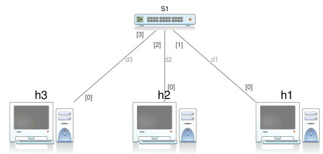

# Host to Network level

## Esercizio 1

Configurare una rete con topologia mostrata in figura e utilizzando gli indirizzi IP proposti in tabella. Utilizzare una configurazione permanente e alias degli host consistenti su ciascuna macchina. Il dispositivo S1 è uno SWITCH.

| Machine | IP address |
|---------|------------|
|@h1|192.168.1.1|
|@h2|192.168.1.2|
|@h3|192.168.1.3|

Testare la rete lanciando `arping` e `ping` da `@h1` verso `@h2` ed eseguendo `tcpdump` su `@h2` e su `@h3`.

Cosa si deduce osservando il traffico sui vari nodi? Si è ottenuto un risultato coerente con il funzionamento di uno switch?

> [Solution](./exercise-01.md)

## Esercizio 2

Configurare una rete con topologia mostrata in figura e utilizzando gli indirizzi IP proposti in tabella. Utilizzare una configurazione permanente e alias degli host consistenti su ciascuna macchina. Il dispositivo H1 è un HUB.

| Machine | IP address |
|---------|------------|
|@h1|192.168.1.1|
|@h2|192.168.1.2|
|@h3|192.168.1.3|

Testare la rete lanciando `arping` e `ping` da `@h1` verso `@h2` ed eseguendo `tcpdump` su `@h2` e su `@h3`.

* Quali sono le differenze rispetto all'esercizio precedente?

> [Soluzione](./exercise-02.md)

## Exercise 3

## Exercise 4

## Exercise 5

## Exercise 6