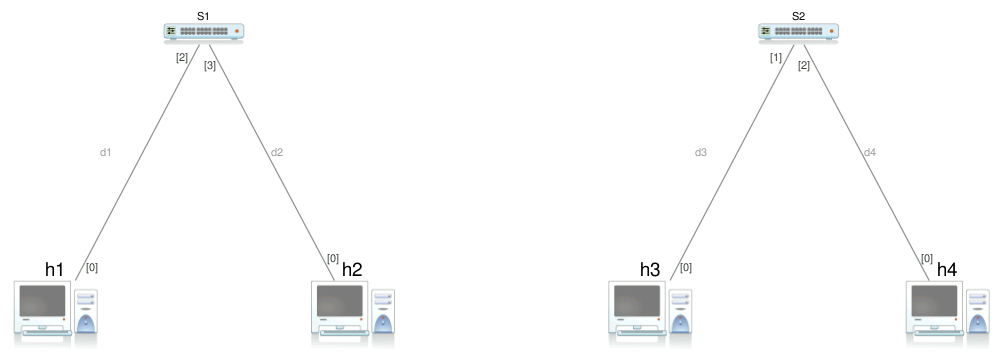
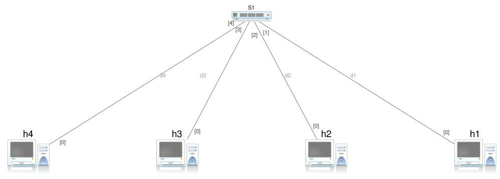
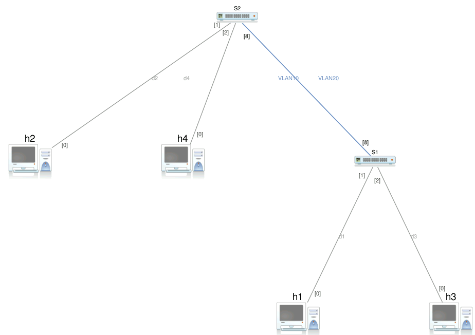
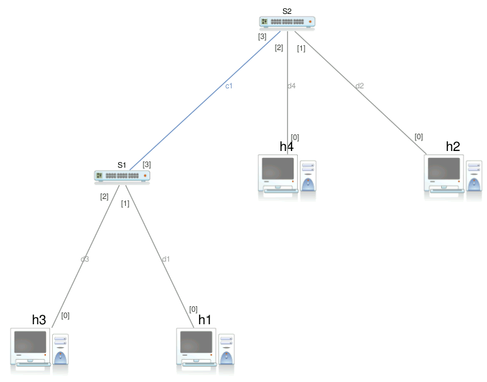

# Virtual Lan

## Esercizio 1

Configurare una rete con topologia mostrata in figura e utilizzando gli indirizzi IP proposti in tabella. Utilizzare una configurazione permanente e alias degli host consistenti su ciascuna macchina.

| Machine | IP address |
|---------|------------|
|@h1|10.0.0.1|
|@h2|10.0.0.2|
|@h3|10.0.0.3|
|@h4|10.0.0.4|

Testare le comunicazioni e verificare siano validi a livello IP e a livello rete i seguenti punti:
* `@h1` comunica con `@h2`
* `@h3` comunica con `@h4`
* Non deve esistere alcun tipo di comunicazione fra le coppie di host `@h1, @h2` e `@h3, @h4`

> [Soluzione](./exercise-01.md)

## Esercizio 2

Configurare una rete con topologia mostrata in figura e utilizzando gli indirizzi IP proposti in tabella. Utilizzare una configurazione permanente e alias degli host consistenti su ciascuna macchina.

| Machine | IP address |
|---------|------------|
|@h1|10.0.0.1|
|@h2|10.0.0.2|
|@h3|10.0.0.3|
|@h4|10.0.0.4|

Testare le comunicazioni e verificare siano validi a livello IP e a livello rete i seguenti punti:
* `@h1` comunica con `@h2`
* `@h3` comunica con `@h4`
* Non deve esistere alcun tipo di comunicazione fra le coppie di host `@h1, @h2` e `@h3, @h4`

>[!TIP]
> Utilizzare le VLAN configurando opportunamente gli switch.

> [Soluzione](./exercise-02.md)

## Esercizio 3

Configurare una rete con topologia mostrata in figura e utilizzando gli indirizzi IP proposti in tabella. Utilizzare una configurazione permanente e alias degli host consistenti su ciascuna macchina.

| Machine | IP address |
|---------|------------|
|@h1|10.0.0.1|
|@h2|10.0.0.2|
|@h3|10.0.0.3|
|@h4|10.0.0.4|

Testare le comunicazioni e verificare siano validi a livello IP e a livello rete i seguenti punti:
* `@h1` comunica con `@h2`
* `@h3` comunica con `@h4`
* Non deve esistere alcun tipo di comunicazione fra le coppie di host `@h1, @h2` e `@h3, @h4`
* Devono essere utilizzati solamente collegamenti VLAN **access link**

>[!WARNING]
> Si noti che:
> * Gli host appartenenti alla stessa VLAN sono collegati a switch diversi
> * Gli switch sono collegati da due cavi cross, uno per ciascuna VLAN

> [Soluzione](./exercise-03.md)

## Esercizio 4

Configurare una rete con topologia mostrata in figura e utilizzando gli indirizzi IP proposti in tabella. Utilizzare una configurazione permanente e alias degli host consistenti su ciascuna macchina.

| Machine | IP address |
|---------|------------|
|@h1|10.0.0.1|
|@h2|10.0.0.2|
|@h3|10.0.0.3|
|@h4|10.0.0.4|

Testare le comunicazioni e verificare siano validi a livello IP e a livello rete i seguenti punti:
* `@h1` comunica con `@h2`
* `@h3` comunica con `@h4`
* Non deve esistere alcun tipo di comunicazione fra le coppie di host `@h1, @h2` e `@h3, @h4`
* Devono essere utilizzati collegamenti VLAN sia del tipo **access link** sia del tipo **trunk link**

>[!TIP]
> Il cavo cross deve consentire il trasferimento di dati appartenenti ad entrambe le VLAN affinchè le comunicazioni funzionino correttamente.

> [Soluzione](./exercise-04.md)