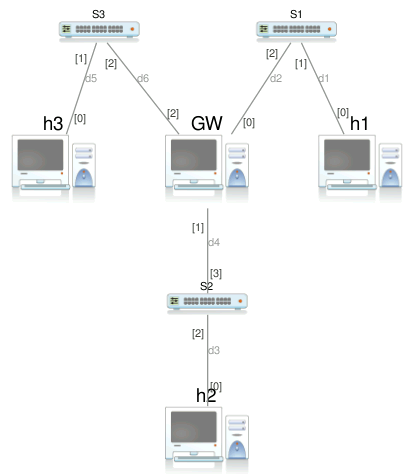
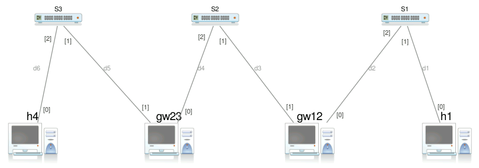
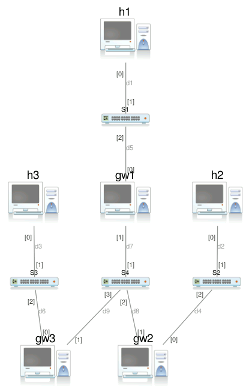
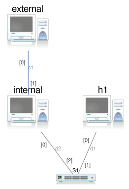
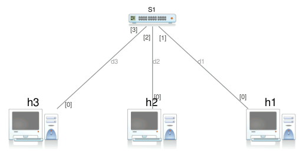

# Routing

## Esercizio 1

Configurare una rete con topologia mostrata in figura e utilizzando gli indirizzi IP proposti in tabella. Utilizzare una configurazione permanente e alias degli host consistenti su ciascuna macchina.

| Machine | IP address |
|---------|------------|
|@h1|192.168.1.1/24|
|@h2|192.168.2.1/24|
|@h3|192.168.3.1/24|
|@GW|192.168.{1,2,3}.254/24|

Si noti che l'host `@GW` possiede 3 schede di rete e funge da gateway.

Obiettivo dell'esercizio è che tutti i nodi possano comunicare fra di loro.

> [Soluzione](./exercise-01.md)

## Esercizio 2

Configurare una rete con topologia mostrata in figura e utilizzando gli indirizzi IP proposti in tabella. Utilizzare una configurazione permanente e alias degli host consistenti su ciascuna macchina.

| Machine | NIC | IP address |
|---------|-----|------------|
|@h1|eth0|192.168.1.1/24|
|@gw12|eth0|192.168.1.254/24|
|@gw12|eth1|192.168.2.253/24|
|@gw23|eth0|192.168.2.254/24|
|@gw23|eth1|192.168.3.254/24|
|@h4|eth0|192.168.3.1/24|

Si noti che gli host `@gw12, @gw23` possiedono 2 schede di rete e fungono da gateway.

Obiettivo dell'esercizio è che tutti i nodi possano comunicare fra di loro.

> [Soluzione](./exercise-02.md)

## Esercizio 3

Configurare una rete con topologia mostrata in figura e utilizzando gli indirizzi IP proposti in tabella. Utilizzare una configurazione permanente e alias degli host consistenti su ciascuna macchina.

| Machine | NIC | IP address |
|---------|-----|------------|
|@h1|eth0|192.168.1.1|
|@h2|eth0|192.168.2.1|
|@h3|eth0|192.168.3.1|
|@gw1|eth0|192.168.1.254|
|@gw1|eth1|10.0.0.1|
|@gw2|eth0|192.168.2.254|
|@gw2|eth1|10.0.0.2|
|@gw3|eth0|192.168.3.254|
|@gw3|eth1|10.0.0.3|

* Tutti i gateway hanno l'interfaccia `eth1` che si collega alla rete `10.0.0.0/8`.
* Sui gateway si deve evitare di utilizzare regole di default routing.

Obiettivo dell'esercizio è che tutti i nodi possano comunicare fra di loro.

> [Soluzione](./exercise-03.md)

## Esercizio 4

Configurare una rete con topologia mostrata in figura e utilizzando gli indirizzi IP proposti in tabella. Utilizzare una configurazione permanente e alias degli host consistenti su ciascuna macchina.

| Machine | NIC | IP address |
|---------|-----|------------|
|@h1|eth0|192.168.1.1/24|
|@internal|eth0|192.168.1.2/24|
|@internal|eth1|1.1.1.1/32|
|@external|eth0|2.2.2.2/32|

* Il collegamento fra `internal` e `external` è un *cavo cross*.
* L'host `internal` funge da gateway fra la rete `192.168.1.0/24` e l'host `external`.
* Evitare di utilizzare regole di default routing su `internal` e `external`.

Obiettivo dell'esercizio è che tutti i nodi possano comunicare fra di loro.

> [Soluzione](./exercise-04.md)

---

>[!WARNING]
> Gli esercizi seguenti combinano problemi di rotuing e VLAN. Prima di svolgere i seguenti esercizi assicurarsi di aver svolto gli [esercizi sulle VLAN](../chapter-02/).

## Esercizio 5

Configurare una rete con topologia mostrata in figura e utilizzando gli indirizzi IP proposti in tabella. Utilizzare una configurazione permanente e alias degli host consistenti su ciascuna macchina.

| Machine | NIC | IP address |
|---------|-----|------------|
|@h1|eth0|192.168.1.1|
|@h2|eth0|192.168.{1,2}.254|
|@h3|eth0|192.168.2.1|

* Ogni host ha una sola scheda di rete
* Si considerano due sottoreti `192.168.1.0/24` e `192.168.2.0/24`
* L'host `@h2` deve essere raggiungibile da due indirizzi IP
* Le VLAN devono essere configurate in modo da tenere le due subnet separate

Obiettivo dell'esercizio è che tutti i nodi possano comunicare fra di loro.

> [Soluzione](./exercise-05.md)